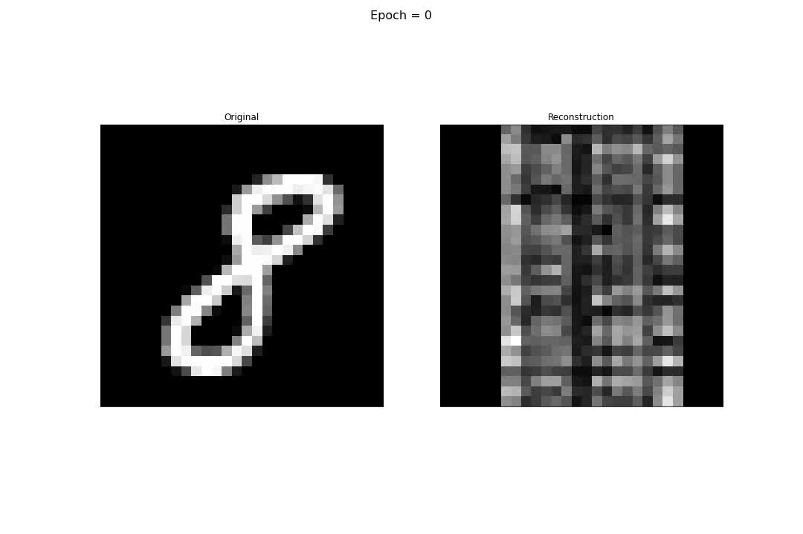

# High Dimensional Analysis Laboratory

  

  <i> Huấn luyện Autoencoder cho bài toán Nonnegative Matrix Factorization (NMF) </i>  
  <i> (Trái) Ảnh gốc. (Phải) Ảnh được khôi phục từ phép nhân hai ma trận không âm tại các epoch là bội số của 100 </i>

Bài tập thực hành môn Xử lý đa chiều HK2 20-21  
Nội dung các bài thực hành:
<ul>
  <li> <b> Lab 01: </b> Principal Component Analysis </li>
  <li> <b> Lab 02: </b> Linear Discriminant Analysis </li>
  <li> <b> Lab 03: </b> K-Means </li>
  <li> <b> Lab 04: </b> t-SNE </li>
</ul>
<i> Note: </i> Để hiểu rõ hơn ảnh .gif, có thể xem file code cài đặt Autoencoder cho bài toán NMF trong thư mục <a href = https://github.com/PhuThanh-Nguyen/High-Dimensional-Analysis-Coursework/tree/main/Finals> Finals </a> của repo này
